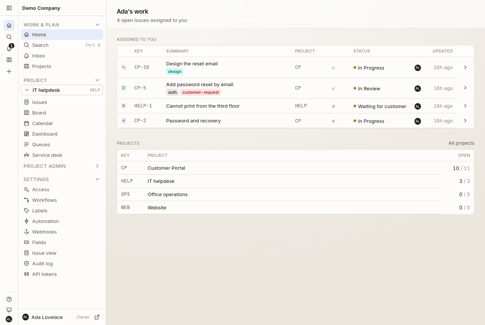
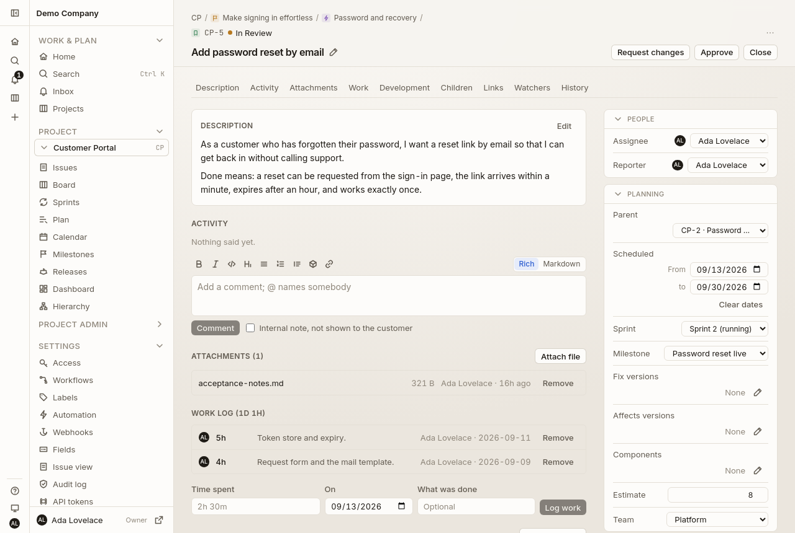
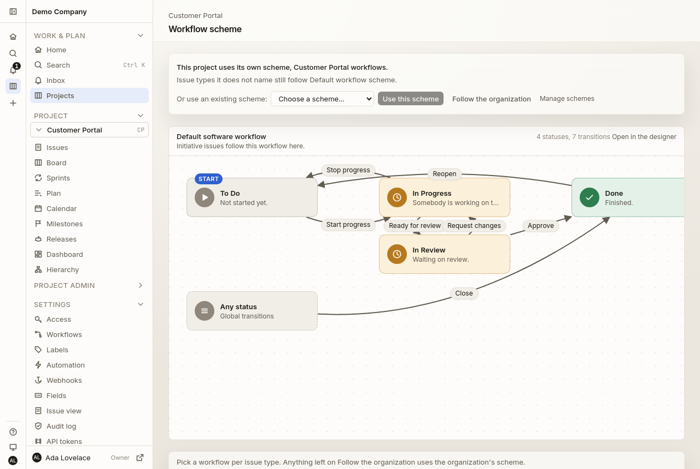
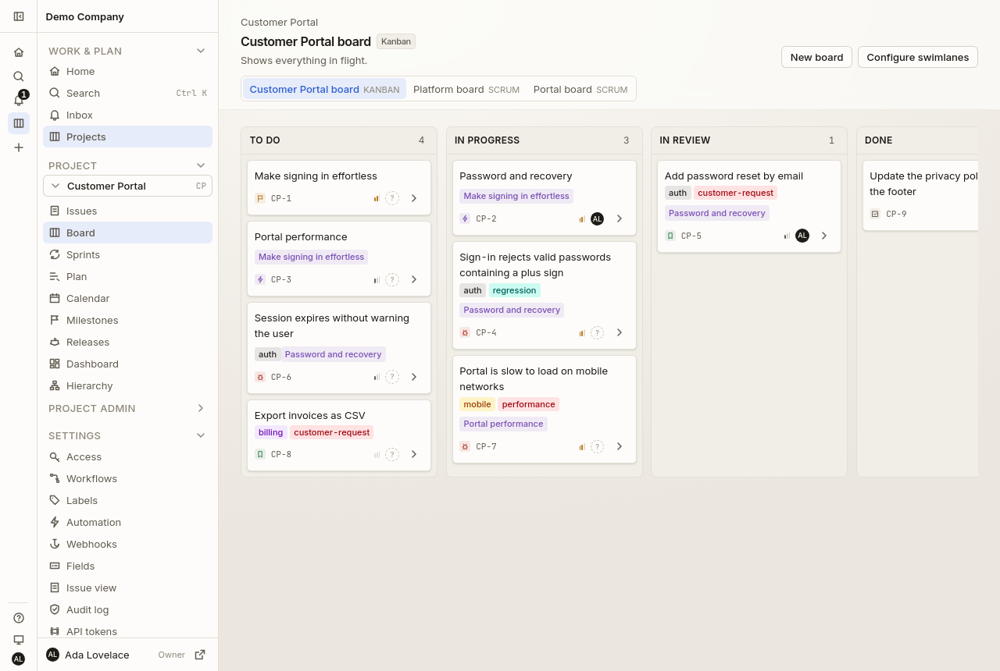
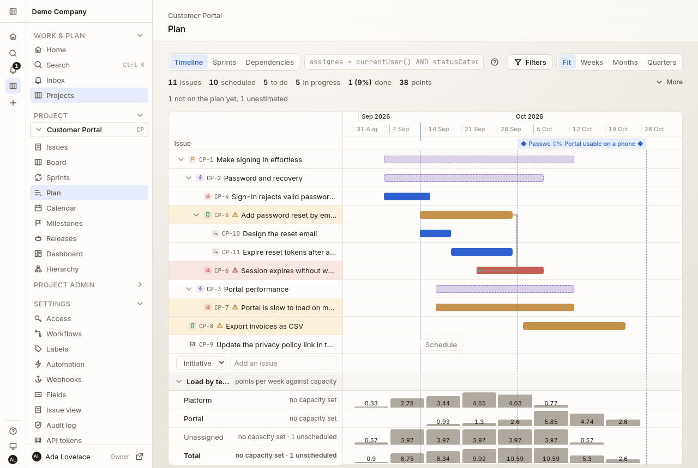
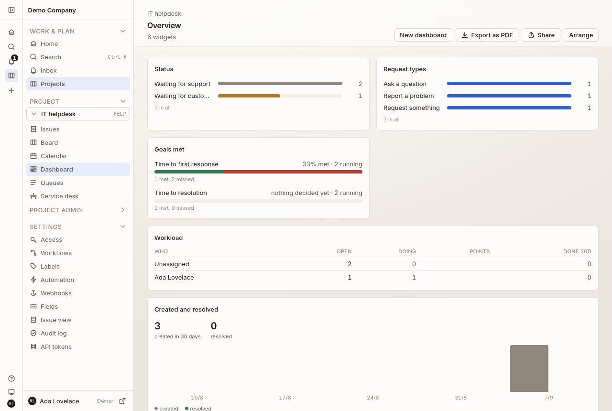

# Armature

**Project and service management in the Jira and Jira Service Management
class**, self-hosted. Configurable projects and issues, a real workflow engine,
agile planning, bidirectional git and CI integration, and a service desk.

[](LICENSE)
[](backend/go.mod)
[](web/package.json)
[](backend/migrations)
[](deploy/charts/armature)



Go API and worker, React SPA, PostgreSQL with read replicas, multi-tenant from
the first table. Pre-1.0 and unreleased: it runs, it is tested four ways, and
nothing is tagged yet.

This file is how to run it, test it and operate it. What it does is summarised
below and argued in [`docs/decisions.md`](docs/decisions.md); the whole product
in pictures is [`docs/screenshots.md`](docs/screenshots.md); what it looks like
by design is [`docs/design/`](docs/design); what it holds about people is
[`docs/privacy.md`](docs/privacy.md).

## Two commands, nothing installed

Every toolchain runs in a container. There is no Go, no Node and no Postgres to
install; Docker is the only requirement.

```sh
git clone https://github.com/armature/armature.git && cd armature
make up      # postgres primary and replica, valkey, seaweedfs, mailpit,
             # keycloak, gitea, the api, the worker, the SPA and the renderer
make seed    # a demo organization to sign in to
```

Then open <http://localhost:5173> and sign in as `ada@armature.test` with the
password the seed prints. There is a demo project with issues spread across the
workflow waiting for you.

Or sign in the way a company would: on the sign-in page choose single sign-on
and give the organization `demo`. The stack runs a Keycloak at
<http://localhost:8180> (admin console: `admin` / `admin`) with the same
people, the same password, and groups that grant their roles here. Grace is in
`portal-owners` and `scrum-masters`, Alan in `developers`, Rita in `readers`;
move somebody between groups in Keycloak and their role here follows at their
next sign-in.

The stack also runs a Gitea at <http://localhost:3001> (`demo` / the same
password), and the seed connects the demo project to a repository there. Open
an issue, make a branch for it, and the branch is really on that Gitea; push to
it there and the push is really on the issue.

```sh
make help              # every target
make test-all          # all four test layers, in order
make down              # stop      (make clean also drops the volumes)
```

The compose stack is for development: it publishes every port on `127.0.0.1`
only, and its passwords are in the file. A deployment changes all of them, and
[the chart](#deploying-it) is where that is written down.

## What it does

Each of these is argued in [`docs/decisions.md`](docs/decisions.md), which is
the reference for why.

**Projects and issues.** A project starts from a template that decides its kind,
its first board, its workflows and which pages it has. Issues carry a summary, a
rich text description, a type, a priority, an assignee and a reporter, labels
shared across the organization, files, the fields the project defined, a time
estimate with work logged against it, and a changelog of everything that
happened. The hierarchy is strict: a parent is exactly one level above its
child, initiative over epic over story over subtask, enforced by a trigger. A
project administrator decides which fields an issue shows and where, per issue
type, over an organization default.



**Workflows.** A state machine per issue type, drawn on a canvas where the
statuses stay where they were left and the conditions, validators and
post-functions hang on the arrows. The organization keeps a library of
workflows and schemes; a project maps a type to one of them and inherits the
rest.



**Roles.** Five of them, granted to people or to groups, over the organization
or over one project: global administrator, project administrator, scrum master,
user, reader. Groups can come from the identity provider, replaced at every
sign-in. An administrator makes local accounts with a password, resets them
and switches them off. A project is a wall: what a role does not reach is not
found.

**Planning.** Boards (scrum follows the running sprint, kanban shows
everything), backlogs, sprints per team with capacity, a timeline where epics
span their children and dependencies are drawn and checked, milestones and
versions, and a dependency graph laid out by longest path.





**Git.** Repositories on GitHub, GitLab or Gitea, connected both ways: commits,
branches, pull requests and CI runs appear on the issues they name, a commit
message can move an issue, and a branch made from an issue is followed through
every push and its merge.

**Service desk.** A customer portal where a request is an ordinary issue with a
request type, internal notes the customer never sees, response and resolution
goals whose clocks move inside the issue's own transaction, knowledge base
articles, replies by mail in and out, and a rating link when it closes.



**Reading the work.** NQL, a query language compiled to bound SQL from a
catalog, with a search bar that finishes the sentence; saved filters that
everything else reads live; dashboards whose numbers are computed on read,
shared by link, printed to PDF; CSV export, and a CSV import that keeps another
tracker's keys, dates, people, hierarchy, sprints, links, comments and worklogs.

**Being told.** One fan-out per event to an inbox and, if the person wants,
mail; webhooks signed, retried and logged; automation rules that run as an
account of their own, once per event.

**The API.** Everything the SPA does is the documented API, and the same table
of operations is offered to a model over MCP. The assistant answers from an
index of the product first, and a model second, behind the same door as the
person asking; anything it would change comes back as a proposal to confirm.

## How it is put together

```
browser ──> web (Vite SPA, Tailwind)
              │ REST, one origin: /api is proxied to the API
              ▼
         api (Go, chi)  ──writes──> Postgres primary ──streaming repl──> replicas
              │                          │                                 ▲
              │ outbox                   └─────────── reads ───────────────┘
              ▼
         Redis streams ──> worker (outbox relay, webhooks, notifications, SLAs,
                                   automation, mail in and out, retention)
```

Writes go to the primary and return the write ahead log position they committed
at; a reader who just wrote is pinned to a replica caught up past it, or to the
primary. Every tenant table carries a forced row level security policy on
`current_org_id()`, set transaction-locally, and the API connects as a role that
is neither owner nor superuser. Events are written to an outbox table in the
same transaction as the change and relayed to Redis, so an event never describes
a transaction that rolled back.

## Deploying it

[`deploy/charts/armature`](deploy/charts/armature) installs the api, the worker,
the SPA and, if asked, the PDF renderer. Postgres, Redis and object storage are
yours to supply; one values file bundles all three for a look at the product.

```sh
make helm-deps    # fetch the pinned subcharts, once

helm install demo deploy/charts/armature \
  -f deploy/charts/armature/values-demo.yaml       # a trial: one database pod, no TLS

helm install armature deploy/charts/armature \
  --set database.host=postgres.internal \
  --set externalRedis.host=redis.internal \
  --set ingress.host=armature.example.com \
  --set secrets.existingSecret=armature-secrets    # a deployment
```

Three things the chart's own [README](deploy/charts/armature/README.md) explains
at length, because each is a way to get it wrong:

- **Three database roles.** The application never connects as a privileged one.
  Outside `development` both binaries refuse to start if the role they are given
  has `rolsuper` or `rolbypassrls`. The admin role is exempt from row level
  security by policy, not by `BYPASSRLS`, which is exactly why it still passes.
- **The role names must match the migrations.** Every role reference in a
  migration is wrapped in `IF EXISTS`, so a name that does not match is skipped
  rather than refused: the grants and the RLS bypass go missing and nothing says
  so. The chart takes one value per role name for that reason.
- **The worker runs once.** `worker.replicas` may only be 1 and the chart
  refuses anything else. There is no leader election, the Redis consumers all
  identify themselves as the literal `worker`, and the hourly digest remembers
  what it has sent in an in-process map.

`make helm-lint` lints both values files and `make helm-check` fails if the
rendered manifests differ from the golden files committed under `tests/`, which
is the same bargain `api/openapi.json` strikes.

## Testing

Four layers, each testing something the layer below cannot.

| Command | What it covers |
|---|---|
| `make test` | Pure logic: argon2 hashing, token digests, slug shapes, LSN parsing, replica selection, freshness pinning, the query compiler, markup conversion |
| `make test-integration` | The Go stack against real Postgres: row level security, streaming replication, the auth service, the HTTP API through its real router and middleware, the outbox relay |
| `make npm ARGS="run test"` | The SPA: API client error handling, theme persistence, forms and UI primitives |
| `make test-e2e` | A real Chromium against the running stack, 130 scenarios over every feature: signing in, roles, projects and issues, workflows, boards, sprints, the plan, git, the desk, dashboards, search, import and export |

Nothing is mocked below the layer under test. The integration suite talks to the
actual primary and replica, pauses WAL replay to create deterministic lag, and
asserts tenant isolation with two organizations holding real credentials. The
browser suite drives the same UI a person would. A guard is not proven by the
service refusing: the same thing is tried straight through SQL and the database
refuses it too.

The integration target stops the worker while it runs, because the relay tests
start their own relays and assert on exactly which events were published; a
background worker draining the same outbox would race them. It is restarted
afterwards, including on failure.

The browser suite runs its scenarios four abreast: every scenario signs up an
organization of its own, so none waits for another, and each worker keeps one
Chromium for the whole run with a fresh incognito context per scenario.
`WORKERS=<n>` sets the number of browsers and `ONLY=<words>` narrows the run to
the scenarios whose names contain them; `WORKERS=1` is the reference when the
order of things matters. A page load is waited for by the page's own word,
`data-settled` on the body, which the app writes from its in-flight queries and
the router's state.

The API is described by `api/openapi.json`, derived from the handler tables and
types. After changing a route or a request or response type, run `make openapi`
and commit the regenerated document and `web/src/api/schema.d.ts`; a unit test
refuses a stale copy, the integration suite validates every response against it,
and the last test of the suite refuses a run that left an operation unexercised.

There is no CI. A branch is merged when all four layers have passed on it,
locally, which [`CLAUDE.md`](CLAUDE.md) states as the working agreement along
with the house style.

## Operations

Both binaries say how they are doing in two ways, neither through the API.

**Metrics.** The api and the worker each serve `/metrics` in the Prometheus
exposition format on `ARMATURE_METRICS_ADDR`. It is a listener of its own, never
a route in the API, and neither the compose file nor the chart's ingress
publishes it. The series are all named `armature_*` and written down once in
`internal/observability/metrics.go`: requests by method, route pattern and
status, request and statement durations, the outbox's backlog and throughput,
every consumer group's handled events and unacknowledged count, every periodic
job's passes, mails handed to SMTP, the cluster's routing counters and pool
sizes, and the Go runtime.

**Traces.** With `ARMATURE_OTEL_ENDPOINT` set to a collector's traces URL, each
binary sends OpenTelemetry spans over HTTP: one per request, one per statement
under it, one per pass of a job, and one per event a consumer group handles, in
the trace of the request that emitted it, because the outbox row and the stream
message carry the traceparent along. The trace id comes back as `X-Trace-Id`
and sits in the access line beside the request id.

`make observe` starts Jaeger and Prometheus beside the stack and restarts the
api and the worker with Jaeger as their endpoint; Jaeger is at
`localhost:16686`, Prometheus at `localhost:9090`. `make observe-down` stops
them again. Nothing of this runs unless asked.

**Security at the edges.** A session reaches what its proof vouches for: a
password reaches every organization the person belongs to, a mailed code, an
open desk door and single sign-on reach only the organization that asked for
them, and the database refuses the switch as well. A write carrying the session
cookie must say it is JSON and, in production, come from one of this
application's origins. Guessing at a password or an invitation is braked by the
address guessed at, which is the connection's own unless it comes from a proxy
named in `ARMATURE_TRUSTED_PROXIES`. The server calls out only where
`ARMATURE_OUTBOUND_ALLOW` permits: a webhook endpoint, a git host or an issuer is
resolved first and dialled as the address that was checked, so nothing inside
the network answers by accident. [`SECURITY.md`](SECURITY.md) says what to try
to break, and how to report it.

**Personal data has a lifetime.** [`docs/privacy.md`](docs/privacy.md) is the
record of processing. The worker sweeps what has served its purpose on start and
every day, each window a `ARMATURE_RETAIN_*` duration. A person downloads
everything held about them from their profile as one JSON file and deletes their
account there: the identity goes, what they wrote stays by "Former user".

<details>
<summary><b>Every environment variable, with its default</b></summary>

A duration is Go syntax (`720h`, `30s`); a list is comma separated.

| Variable | Default | What it is |
|---|---|---|
| `ARMATURE_ENV` | `development` | `development`, `staging` or `production`; the last two require secure cookies |
| `ARMATURE_HTTP_ADDR` | `:8080` | where the api listens |
| `ARMATURE_LOG_LEVEL` | `info` | slog level |
| `ARMATURE_APP_URL` | `http://localhost:5173` | where links in mail point, and the origin writes must come from |
| `ARMATURE_CORS_ORIGINS` | none | extra origins allowed to call the API |
| `ARMATURE_TRUSTED_PROXIES` | none | addresses or CIDRs whose `X-Forwarded-For` is believed |
| `ARMATURE_OUTBOUND_ALLOW` | none | addresses, CIDRs or host names the server may call inside the network |
| `ARMATURE_DB_PRIMARY_URL` | required | the writable Postgres |
| `ARMATURE_DB_REPLICA_URLS` | none | read replicas |
| `ARMATURE_DB_ADMIN_URL` | the primary | the role exempt from row level security |
| `ARMATURE_DB_MAX_CONNS` / `_MIN_CONNS` | `20` / `2` | pool bounds per process |
| `ARMATURE_DB_CONN_MAX_LIFETIME` | `1h` | how long a connection is kept |
| `ARMATURE_DB_HEALTH_INTERVAL` | `5s` | how often a replica's lag is re-read |
| `ARMATURE_DB_MAX_REPLICA_LAG` | `2s` | lag past which a replica is not used |
| `ARMATURE_DB_REPLICA_LAG_SAMPLES` | `3` | samples kept per replica |
| `ARMATURE_REDIS_URL` | `redis://localhost:6379/0` | the event stream |
| `ARMATURE_SIGNUP` | `open` | who may create an organization: `open`, `first` (only the first one) or `closed` |
| `ARMATURE_SESSION_TTL` | `720h` | how long a session lives |
| `ARMATURE_SESSION_COOKIE` | `armature_session` | the cookie's name |
| `ARMATURE_SECURE_COOKIES` | `false` | required true outside development |
| `ARMATURE_ARGON_MEMORY_KIB` / `_ITERATIONS` / `_THREADS` | `65536` / `3` / `4` | password hashing cost |
| `ARMATURE_READ_YOUR_WRITES_TTL` | `30s` | how long a writer is pinned past their write |
| `ARMATURE_PORTAL_CODE_COOLDOWN` | `1m` | how long an address waits between portal codes |
| `ARMATURE_SMTP_ADDR` | none | the relay; empty turns mail off |
| `ARMATURE_MAIL_FROM` | `Armature <no-reply@armature.test>` | the sender |
| `ARMATURE_MAIL_INBOX` | none | the address replies come back to; empty turns replies off |
| `ARMATURE_POP3_ADDR` / `_USER` / `_PASSWORD` / `_TLS` / `_INTERVAL` | none, none, none, `false`, `30s` | the mailbox the worker reads replies from |
| `ARMATURE_S3_ENDPOINT` / `_BUCKET` / `_ACCESS_KEY` / `_SECRET_KEY` / `_REGION` / `_USE_SSL` | none, `armature-attachments`, none, none, `us-east-1`, `false` | where attachments and pictures live; no endpoint turns uploads off |
| `ARMATURE_RENDER_URL` / `_TIMEOUT` | none / `20s` | the browser that prints dashboards to PDF |
| `ARMATURE_ASSISTANT_URL` / `_KEY` / `_MODEL` / `_TIMEOUT` | none, none, `claude-sonnet-5`, `25s` | the model behind Ask; no URL turns it off |
| `ARMATURE_METRICS_ADDR` | `:9090` | the metrics listener; blank serves none |
| `ARMATURE_OTEL_ENDPOINT` | none | the collector's traces URL |
| `ARMATURE_OTEL_SAMPLE_RATIO` | `1` | share of new traces kept |
| `ARMATURE_OIDC_BACKCHANNEL` | none | `public=reachable` rewrites for a provider whose addresses differ |
| `ARMATURE_RETAIN_SESSIONS` | `24h` | past expiry |
| `ARMATURE_RETAIN_PORTAL_CODES` | `24h` | past expiry |
| `ARMATURE_RETAIN_OIDC_LOGINS` | `24h` | past expiry |
| `ARMATURE_RETAIN_INVITES` | `720h` | past expiry |
| `ARMATURE_RETAIN_API_TOKENS` | `720h` | past expiry |
| `ARMATURE_RETAIN_OUTBOX` | `720h` | after publication |
| `ARMATURE_RETAIN_WEBHOOK_DELIVERIES` | `720h` | from queueing |
| `ARMATURE_RETAIN_AUTOMATION_RUNS` | `2160h` | from the run |
| `ARMATURE_RETAIN_INBOUND_MAIL` | `2160h` | from arrival |
| `ARMATURE_RETAIN_IMPORT_JOBS` | `2160h` | from the import |
| `ARMATURE_RETAIN_NOTIFICATIONS` | `4320h` | from being made |
| `ARMATURE_RETAIN_AUDIT` | `8760h` | from the entry |

Zero keeps a kind forever, which nothing here recommends.

</details>

<details>
<summary><b>Where everything lives</b></summary>

| Path | What lives there |
|---|---|
| `backend/cmd/` | `api`, `worker`, `migrate`, `seed` |
| `backend/internal/db/` | primary and replica routing, LSN pinning, health |
| `backend/internal/auth/` | argon2id passwords, sessions, tokens, invitations |
| `backend/internal/perm/` | the five roles, what each grants, and who holds what |
| `backend/internal/oidc/` | signing in through an identity provider and reading its groups |
| `backend/internal/workflow/` | the state machine, its rule registry, and the schemes |
| `backend/internal/project/` | projects, keys and their configuration |
| `backend/internal/template/` | the templates a project can start from |
| `backend/internal/git/` | repositories, their webhooks, smart commits and branches |
| `backend/internal/desk/` | request types, the portal, notes, goals and their clocks |
| `backend/internal/report/` | dashboards and the reports their widgets show |
| `backend/internal/field/` | custom fields per project and each issue's answers |
| `backend/internal/arrange/` | which fields an issue shows, where, per project and issue type |
| `backend/internal/label/` | the organization's labels |
| `backend/internal/attachment/` | files on issues and the S3 client the bytes go through |
| `backend/internal/issue/` | issues, transitions, comments, the changelog, the hierarchy, and the import path |
| `backend/internal/csvio/` | issues out as CSV, and a file in: mapping, words, people |
| `backend/internal/nql/` | the query language: lexer, parser, catalog, compiler |
| `backend/internal/board/` | boards, swimlanes, backlogs and the drag that transitions |
| `backend/internal/team/` | the groups inside a project |
| `backend/internal/plan/` | the timeline: roll-up, dependencies, capacity, warnings |
| `backend/internal/sprint/` | sprints, their state machine and the report one leaves |
| `backend/internal/rank/` | the sortable strings that order cards |
| `backend/internal/bootstrap/` | the defaults every new organization gets |
| `backend/internal/httpapi/` | router, middleware, handlers, errors, and the operation table |
| `backend/internal/openapi/` | the document model, schema builder and validator |
| `backend/internal/netguard/` | the guarded client every outbound call goes through |
| `backend/internal/events/` | transactional outbox and its relay |
| `backend/internal/observability/` | logging, metrics and tracing |
| `backend/migrations/` | goose migrations, embedded into the binary |
| `backend/test/` | integration suite (`-tags integration`) |
| `api/` | the generated OpenAPI document, checked in |
| `web/src/` | the SPA |
| `e2e/` | the browser suite: one module per area under `scenarios/` |
| `deploy/` | compose stack, Dockerfiles, Postgres bootstrap, nginx, the Keycloak demo realm |
| `deploy/charts/armature/` | the Helm chart and its golden rendered manifests |

</details>

## Build notes

The Go toolchain is pinned to 1.26 in `Makefile` and `deploy/Dockerfile.backend`.
The development host this was written on runs an endpoint protection agent
(Cortex XDR) that judges every executable and kills the ones it dislikes about
two seconds after they start: exit 137, no OOM, nothing in the logs. Under
`golang:1.27` every test binary died that way; under 1.26 they died again the
day an S3 client library was linked into the api, and stopped when it was
replaced with the standard library client in `internal/attachment/s3.go`. The
verdict is a judgement of the binary's contents, so a new dependency can flip
it. When a binary starts dying at two seconds, suspect the agent before the
code; retest 1.27 before bumping.

The working tree on that host is a Windows drive mounted into WSL, where every
file reads as executable and git is told to ignore modes (`core.filemode` is
false). A script the stack runs directly, such as the replica's entrypoint, is
therefore marked with `git update-index --chmod=+x`, never with `chmod`, or the
bit never reaches a Linux clone.

The render service that prints dashboards is the browser suite's own image
started as a container, and the api reaches it over HTTP with the standard
library, so PDF export adds no dependency to the api binary either.

Metrics and tracing were the largest growth of the binaries since: the
Prometheus client, the OpenTelemetry SDK and its OTLP/HTTP exporter, which
links protobuf and gRPC even though no gRPC server is ever opened. They went
in as three commits on `feature/observability` so a verdict could be told
apart by step, and the agent let all three through. Should it change its
mind: the exposition format is a few hundred lines to write by hand over
`sync/atomic` with the same names; an exporter that posts OTLP as JSON to
`/v1/traces` with `net/http` is about as much and needs no proto; the SDK
itself is plain Go.

## License

[Apache 2.0](LICENSE).
